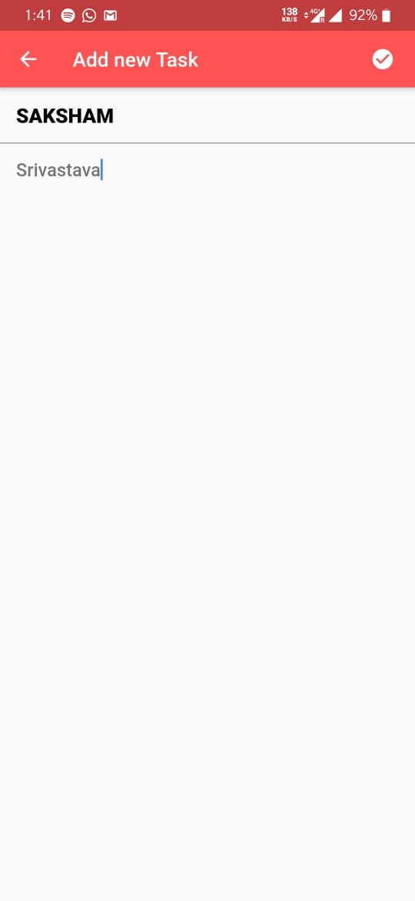
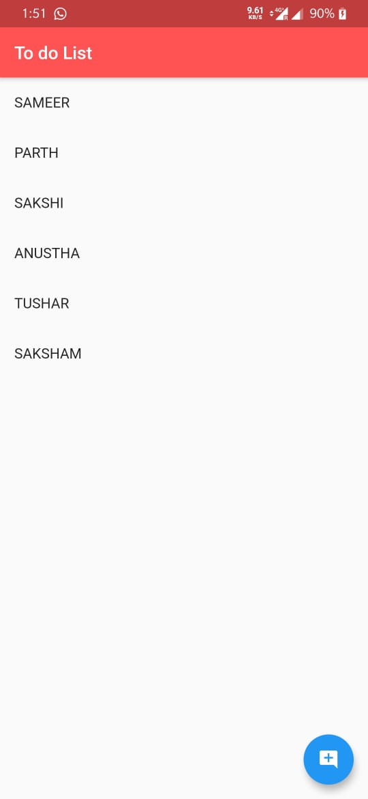
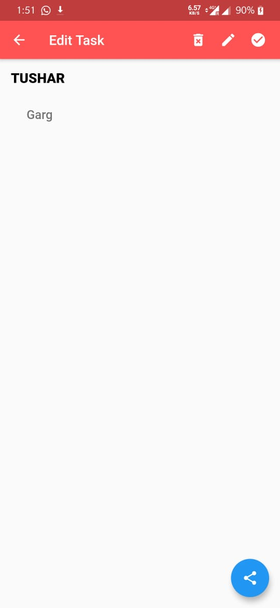
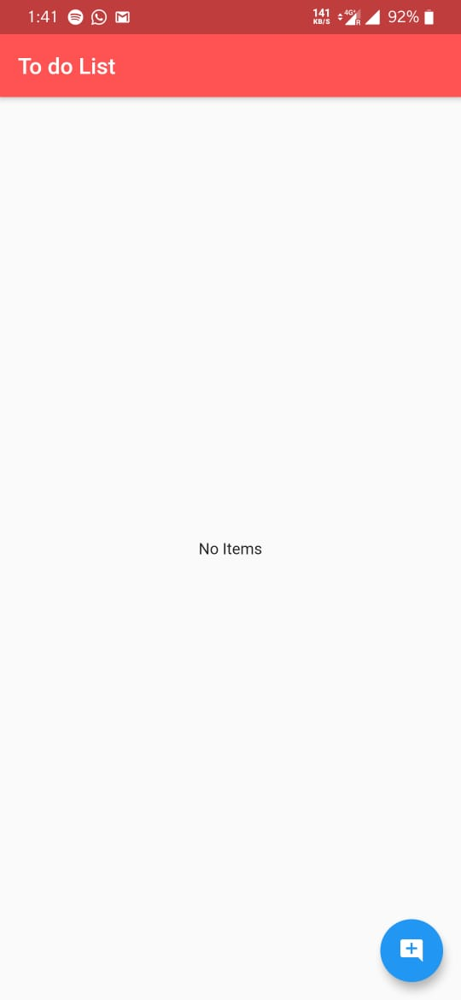

##Simple

ToDo App

##Ios and Android Flutter Project

Simple Flutter Task Manager.

Some features of this app are:

1.Create a task
2.Edit a task
3.Delete a task
4.Data saved through local storage

Technologies Used:
1.Dart
2.Flutter
3.Git and Github
4.Rest API

Packages Used:
1.esys_flutter_share: ^1.0.2
2.shared_preferences: ^0.5.10

Following Screenshots of the app:

